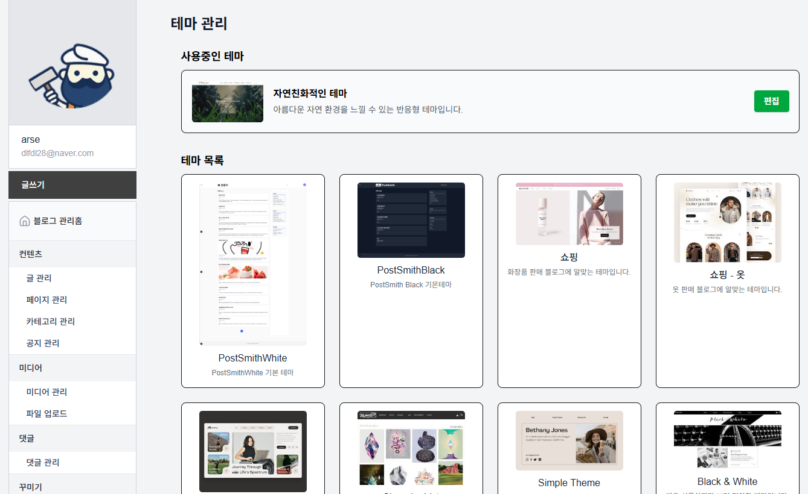

# 네이버 비트캠프 17기 파이널 프로젝트 | [1조] Postsmith

  

## 📖 프로젝트 소개
> 별도의 프로그래밍 지식 없이 손쉽게 블로그를 제작 및 운영하여 누구나 쉽게 콘텐츠를 생산하고 공유할 수 있는 환경 제공해주는 서비스
- **프로젝트명**: Postsmith
- **개발 기간**: 2025.05.07 ~ 2025.06.23
- **인원**: **팀프로젝트 개발(5인)**
- **링크**: [www.postsmith.kro.kr](https://www.postsmith.kro.kr)

## 🖥️ 화면 구성
|미리보기|
|:---:|
||

|홈페이지|로그인|
|:---:|:---:|
|||

|블로그 게시물|개인 블로그 관리 페이지 대시보드|
|:---:|:---:|
|||

|글 관리|카테고리 관리|
|:---:|:---:|
|||

|미디어 관리|통계 페이지|
|:---:|:---:|
|||

|테마 관리|테마 편집|
|:---:|:---:|
|||

## 📊 프레젠테이션

## ⚙ 기술 스택
### Framework

### Backend

### Frontend

### Database

### DevOps

  

### Communication / Tools

## 🛠️ 프로젝트 아키텍처 및 CI / CD
|요청 -> 클러스터|
|:---:|
||

|postsmith 네임스페이스 -> 내부 서비스|
|:---:|
||

|jenkins 네임스페이스 -> 내부 서비스|
|:---:|
||

|Jenkins Multibranch Pipeline|
|:---:|
||

## 📌 주요 기능
- 블로그 홈페이지(추천 게시글 표시, 구독한 블로그, 블로그 테마 리스트 조회)
- OAuth2.0 기반 로그인/회원가입(Google, Github, Kakao, Naver)
- 개인 블로그 개설 및 블로그 글 작성 및 수정, 삭제(글, 페이지, 공지)
- 블로그 글 조회 및 댓글 작성, 수정, 삭제 기능
- 블로그 관리 기능(작성한 글 목록 조회 및 댓글 관리, 카테고리 관리, 미디어 관리)
- 블로그 관리 페이지 대시보드(글 작성, 페이지 공지 작성, 블로그 통계 페이지, 블로그 테마 관리 및 편집 기능)
- 블로그 통계 표시(조회수, 일일 방문자수 통계 정보)
- 블로그 카테고리 관리(카테고리 생성, 수정, 삭제 기능)
- 블로그 메뉴 관리(메뉴 생성, 수정, 삭제 기능)
- 블로그 피드 목록 페이지(구독한 블로그의 글 목록 조회)
- 블로그 테마 목록 페이지(테마 리스트 조회 및 적용)
- 블로그 테마 관리 및 편집(테마 적용, 커스터마이징 기능)

## 👥 프로젝트 팀원 및 담당
|이름|역할|
|:---:|:---|
|[백성현](https://github.com/Seonghyeon8983)|팀장, 블로그 관리 페이지 대시보드, 블로그 UI/UX 설계, 프로젝트 일정관리|
|[김준호](https://github.com/zpzlzmz)|홈페이지, 블로그 카테고리 관리, 블로그 메뉴(사이드바 or 네이게이션) 관리|
|[장진욱](https://github.com/chauid)|로그인/회원가입, 인증 서버 개발, DB 설계 및 관리, 소스 코드 관리, 프로젝트 아키텍처 설계, CI/CD|
|[최원웅](https://github.com/ChoiWonOong)|글 작성 및 페이지 공지 작성, 블로그 통계 페이지, 블로그 테마 관리 및 편집|
|[최준혁](https://github.com/groom2hub)|테마 목록 페이지, 피드 목록 페이지, 개인 블로그 관리 페이지|
